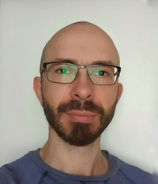

# rssschool-cv



# Maksim Gorin
### **Contact information:**
**Phone:** +79052772555

**E-mail:** grinmak@gmail.com

**Discord rsschool:** Maksim Gorin (@grinmak)

---

**About me:**

Major part of my career I spent in sales. Worked both as a salesman and sales manager. Eventually i gained a courage to tell my self that all that sales-thing not my cup of tee. Then switched to cnc-operator. And now, working on a factory, been able to eficently manipulate most of machines here i see a fewer oportunities to grow further, to learn more. And coding - there is no limits, it`s really exiting. I love to create: photoshop, premiere pro, any kind of filmmaiking, when you can see how small things combine and become  the 'whole', something completly new. Coding gives me the same feeling of satisfaction when mind-skills can transform into real thing.

---

**Familiar with technologies and tools:**

* HTML, CSS
* Java Script
* Git
* VS Code
* Adobe Premiere Pro, Adobe Photoshop

---

**Code example:**
```javascript
function multiply(a, b){
  return a * b
}
```

---

**Courses:**

[The Odin Project](https://www.theodinproject.com/): *Full Stack JavaScript* (in progress)

*Projects:*
  * [Calculator](https://github.com/Grinmak/project_calculator)
  * [Rock Paper Scissors](https://github.com/Grinmak/project_rock_paper_scissors)
  * [Admin Dashboard](https://github.com/Grinmak/project_admin_dashboard)
  * [Sign Up Form](https://github.com/Grinmak/project_sign-up_form)
  * [Sketch Board](https://github.com/Grinmak/project_etch_a_sketch)


---

**Languages:**


* English - Intermediate.

andaccording to test on [www.efset.org](www.efset.org) :


* Russian - Native
